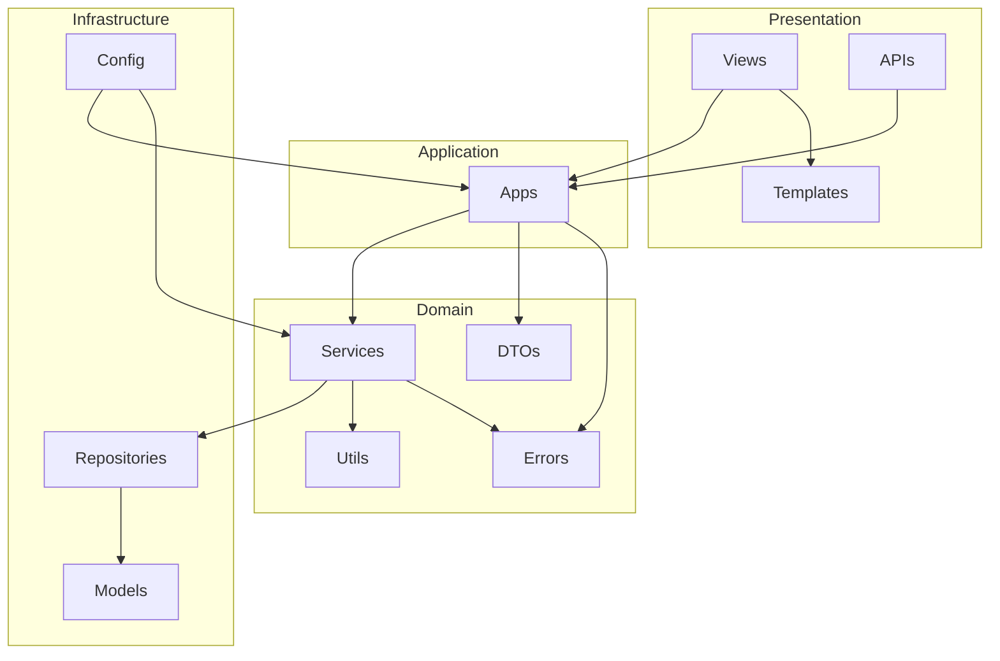
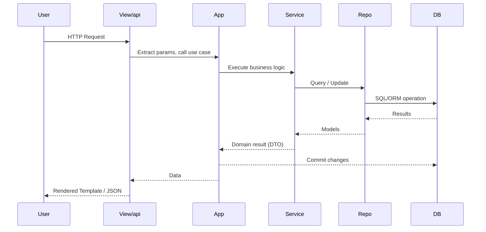

# Project Architecture

This project follows a pragmatic layered architecture inspired by **Clean Architecture** and **Domain-Driven Design (DDD light)**. The goal is to keep the system simple, testable, and maintainable, without adding unnecessary complexity for a small team.

---

## Overview

The system is organized into the following layers and components:

### 1. **Templates**

* Contain HTML, minimal JS, and CSS.
* Rendered by views.

### 2. **Views**

* Define routes for the web UI.
* Handle URL paths, parameters, request bodies, etc.
* Retrieve data from the application layer and render templates.

### 3. **APIs**

* Similar to views, but return JSON instead of templates.
* Used for programmatic access.

### 4. **Apps (Application Layer)**

* Act as **orchestrators** or **scripts** that coordinate services.
* Do not contain business logic (except for DB commit handling for performance reasons).
* Ensure services are called in the correct order.
* Enable testing of services in isolation.

### 5. **Services (Domain Layer)**

* Contain the core business logic.
* Implement domain rules (e.g., importing a file, retrieving information).
* Cannot call other services directly, ensuring independent testability.

### 6. **Repositories (Infrastructure Layer)**

* Provide an abstraction over database queries.
* Used by services to interact with the database.
* Implemented with an ORM, making it possible to swap databases with minimal changes.

### 7. **Models**

* Define the database schema (tables).

### 8. **DTOs (Data Transfer Objects)**

* Define data structures shared between layers.
* Apps return DTOs, which are then serialized by APIs (to JSON) or views (to templates).

### 9. **Utils**

* Contain helper functions and utility classes.
* Shared logic that does not belong in services.
* Must remain small and not contain domain logic.

### 10. **Config**

* Centralized configuration.
* Can be used across all layers.

### 11. **Errors**

* Custom error classes for consistent error handling.

---

## Design Principles

1. **Separation of Concerns**
   Each layer has a single, well-defined responsibility:

   * Presentation (Views, APIs, Templates)
   * Application Orchestration (Apps)
   * Business Logic (Services)
   * Persistence (Repositories, Models)
   * Cross-cutting (DTOs, Config, Errors, Utils)

2. **Testability**

   * Services are isolated and do not depend on each other.
   * Apps orchestrate services, making it easy to test each service independently.

3. **Performance vs. Purity**

   * A single DB commit is handled at the app level for performance reasons (~5x faster) while still maintaining ACID compliance.
   * This is the only exception where a small piece of infrastructure logic exists in the application layer.

4. **Pragmatism over Dogma**

   * We avoid unnecessary complexity (e.g., full Ports & Adapters, full DDD aggregates) that would slow down a small team.
   * The ORM provides enough abstraction to switch databases if needed.

---

## Why This Architecture?

* **Clean separation** makes the system easy to navigate and maintain.
* **Independent services** ensure reliability and testability.
* **DTO contracts** between layers simplify data exchange and serialization.
* **Pragmatic trade-offs** (no over-engineering, only essential abstractions) keep the project lightweight while scalable.

This structure has proven to be both **clean and pragmatic**: it enforces discipline and scalability, without burdening the team with heavy abstractions that are unnecessary for our current scope.

---

## Diagrams

### Layered Architecture

### Data Flow Example

