# GeneWeb - Use cases and OCaml → Python migration

## 📋 Overview

This document details the main use cases of GeneWeb and analyzes what the OCaml code does to facilitate the migration to Python. It does not details the HOW as it is the purpose of the project.

Based on the official repository: https://github.com/geneweb/geneweb

🎯 Objective

Provide a comprehensive functional understanding of GeneWeb OCaml through 10 essential use cases, enabling you to:

- Understand which features to implement in Python
- Identify the business logic of each OCaml module
- Define the operation flows for transposition
- Serve as specifications for migration


🔄 Features covered

Database creation, GEDCOM import/export, Search, Editing, Tree viewing, Authentication, Multilingual, Administration, Maintenance, API

---

## Executive Summary

This document describes the GeneWeb system architecture, focusing on component organization and how components interact through data flows. The document explains the structural design of the genealogical database system and demonstrates how data moves between components during typical user operations.

---


## Part 1: System Architecture Overview

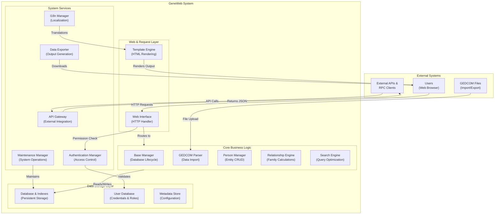

**System Layers:**
1. **External Systems:** Users, files, and external clients
2. **Web & Request Layer:** HTTP handling and HTML rendering
3. **Core Business Logic:** Main genealogical processing
4. **System Services:** Security, localization, maintenance
5. **Data Storage:** Persistent database and metadata

---

## Part 2: 12 Core Components (Catalog)

| Component | Category | Primary Responsibility | Key Operations |
|-----------|----------|----------------------|-----------------|
| **Base Manager** | Logic | Database lifecycle management | Create, Initialize, Configure bases |
| **GEDCOM Parser** | Logic | Genealogical data import | Parse GEDCOM, Validate, Extract records |
| **Person Manager** | Logic | Individual entity management | Create, Read, Update, Delete persons |
| **Relationship Engine** | Logic | Family kinship calculations | Calculate ancestry, Generate trees |
| **Search Engine** | Logic | Information retrieval | Query optimization, Filtering, Pagination |
| **Web Interface** | Web | HTTP request handling | Route requests, Session management |
| **Template Engine** | Web | HTML page generation | Render templates, Apply data substitution |
| **Authentication Manager** | Services | User access control | Login, Permission verification, Session mgmt |
| **Data Exporter** | Services | Export file generation | GEDCOM, JSON, CSV export |
| **I18n Manager** | Services | Localization support | Translation lookup, Formatting per locale |
| **Maintenance Manager** | Services | System administration | Backup, Repair, Optimization |
| **API Gateway** | Services | External API integration | Request parsing, Response serialization |

---

## Part 3: 10 Use Cases with Complete Data Flows

### UC-001: Create New Genealogical Base

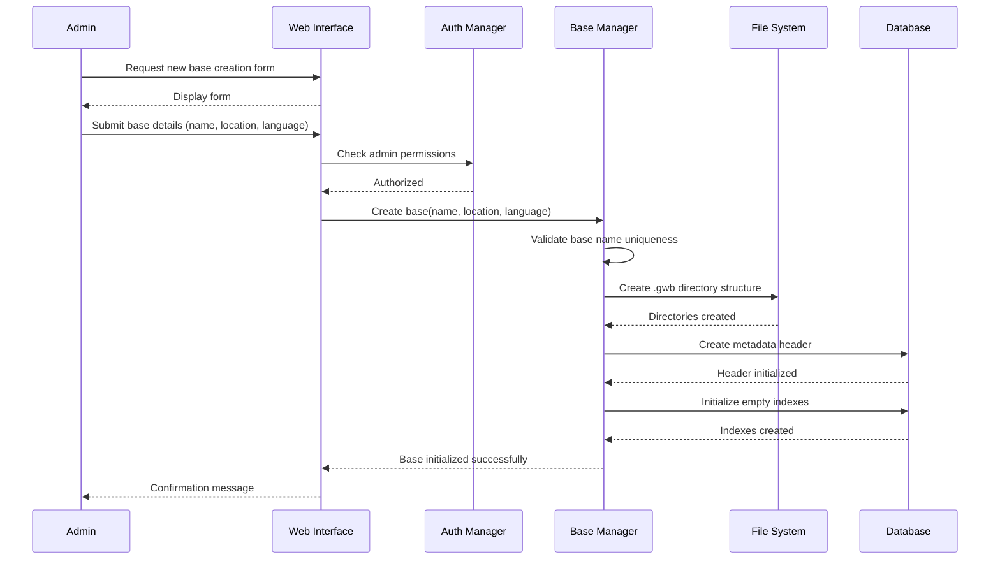

---

### UC-002: Import GEDCOM File

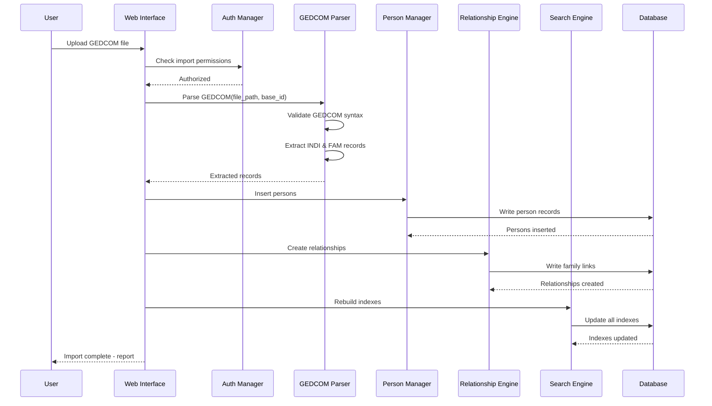

---

### UC-003: Search for Person

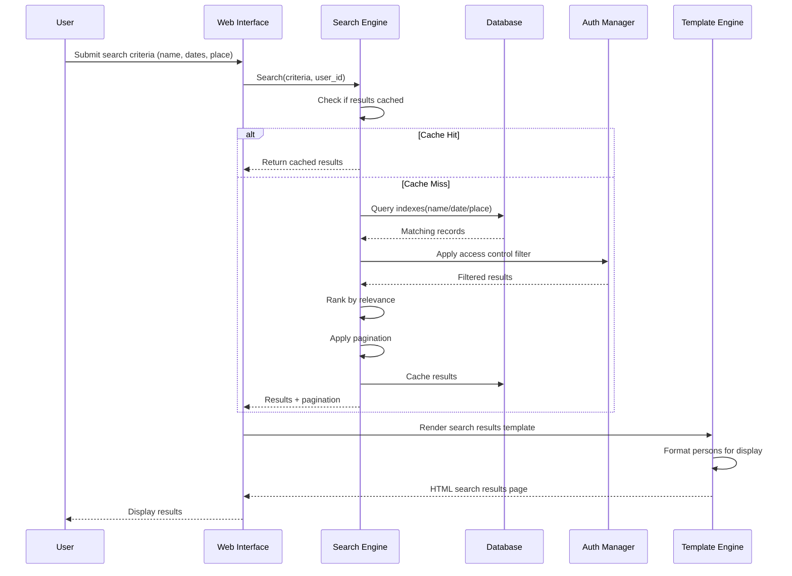

---

### UC-004: Edit Person Information

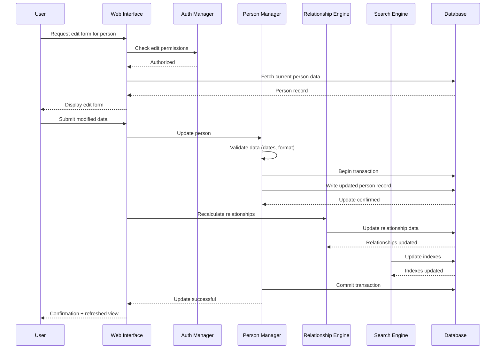

---

### UC-005: Visualize Family Tree

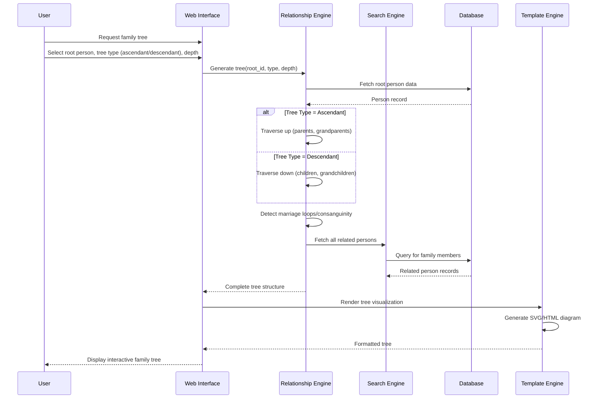

---

### UC-006: Export Database to GEDCOM

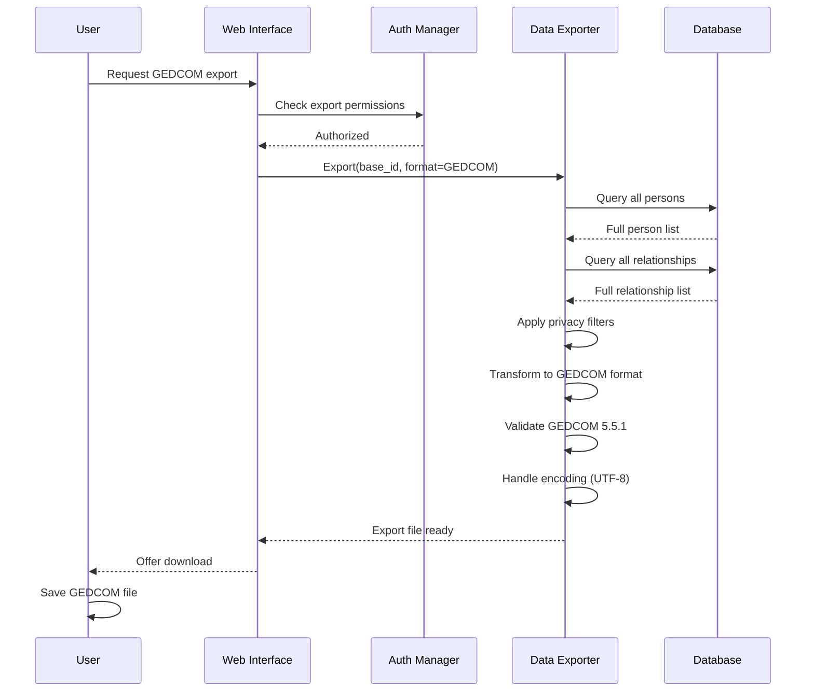

---

### UC-007: User Authentication

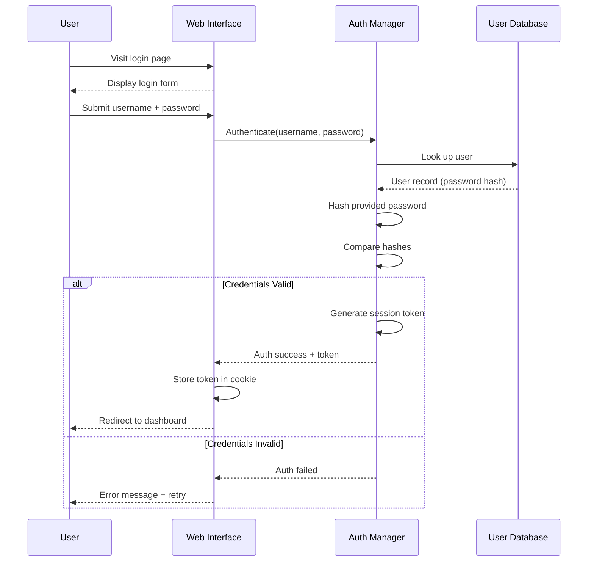

---

### UC-008: Multilingual Interface

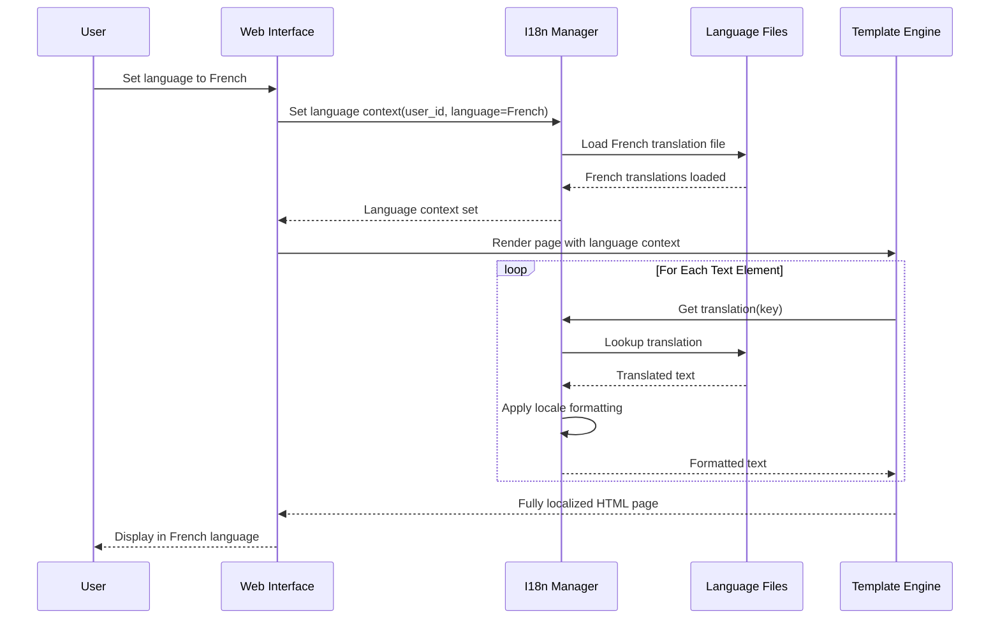

---

### UC-009: Database Backup & Maintenance

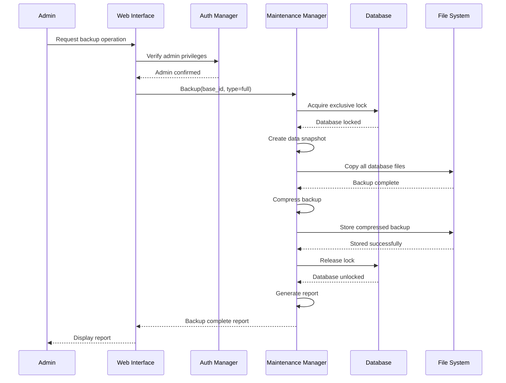

---

### UC-010: External API Request

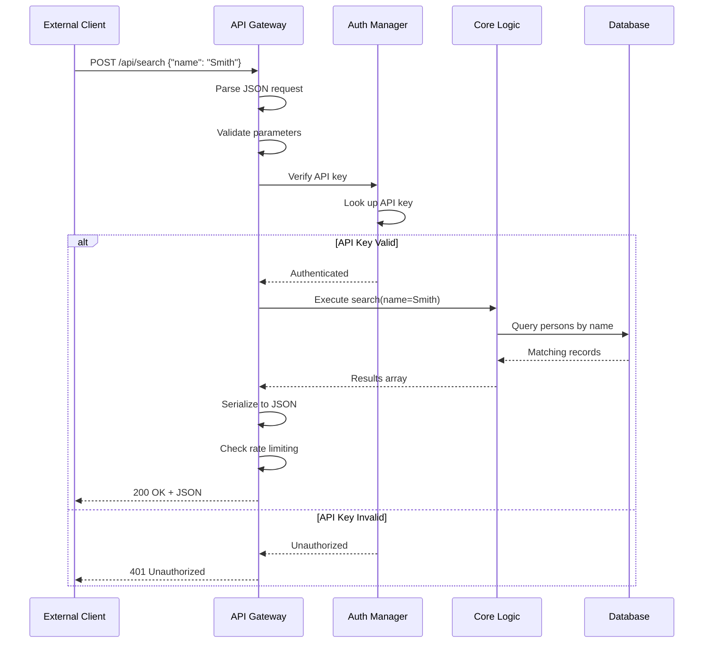

---

## Part 4: Component Interaction Matrix

### 4.1 Communication Pattern

```
Web Interface ↔ All Components (routing hub)
    ↓
Business Logic Components ↔ Repositories (data access)
    ↓
System Services (Auth, I18n, Export, Maintenance) - cross-cutting concerns
    ↓
Database & Storage Layer (persistence)
```

### 4.2 Service Dependencies

- **Base Manager:** Repositories, FileSystem
- **GEDCOM Parser:** Person Manager, Relationship Engine
- **Person Manager:** Repositories, Relationship Engine
- **Relationship Engine:** Repositories, Search Engine
- **Search Engine:** Repositories, Cache
- **Auth Manager:** User Repositories
- **Data Exporter:** Repositories
- **I18n Manager:** Language Files
- **Maintenance Manager:** Repositories, FileSystem

---

## Part 5: Architecture Integration

### 5.1 Request Flow Through All Layers

```
1. User submits HTTP request
   ↓
2. Web Interface (parse & route)
   ↓
3. Auth Manager (verify permissions)
   ↓
4. Business Logic Component (process business rules)
   ↓
5. Repositories (query/update database)
   ↓
6. Database (execute SQL)
   ↓
7. Response flows back up:
   Database → Repo → Service → Web Interface → Template/API → Browser/Client
```

### 5.2 Component to Layer Mapping

- **Presentation:** Web Interface, Template Engine, API Gateway
- **Business Logic:** Base Manager, GEDCOM Parser, Person Manager, Relationship Engine, Search Engine
- **System Services:** Auth Manager, I18n Manager, Data Exporter, Maintenance Manager
- **Infrastructure:** Repositories, Models, Database, Configuration

### 5.3 Communication Rules

**Allowed:**
- Views → Apps/Services
- Services → Repositories
- All → Auth Manager (security gate)
- Template → I18n Manager

**NOT Allowed:**
- Services → Services directly
- Views → Repositories directly
- Repositories → Services

---

## Part 6: Summary, Quality Assurance & Conclusion

### 6.1 Architecture Overview

GeneWeb system consists of:
- **12 core components** organized across 4 layers
- **10 complete use cases** covering all major features
- **Clear component interactions** through defined communication patterns
- **Defined data flow paths** showing how data transforms through layers
- **Security gates** at appropriate levels (Auth Manager)
- **System services** handling cross-cutting concerns

---

### 6.2 Critical Data Flows

Each use case demonstrates a complete data journey through the system:

1. **Import Flow (UC-002):** 
   - GEDCOM file → Parser validation → Person insertion → Relationship creation → Index rebuild
   - Demonstrates: Data transformation pipeline, multi-step orchestration, error handling

2. **Search Flow (UC-003):** 
   - User query → Cache check → Index lookup → Access control filtering → Ranking → Pagination
   - Demonstrates: Performance optimization, security filtering, data ordering

3. **Edit Flow (UC-004):** 
   - Form submission → Data validation → Transaction start → Record update → Relationship recalculation → Index update → Transaction commit
   - Demonstrates: ACID compliance, cascading updates, data consistency

4. **Tree Generation Flow (UC-005):** 
   - Person selection → Graph traversal (ancestors/descendants) → Cycle detection → Related person fetching → SVG/HTML rendering
   - Demonstrates: Graph algorithms, recursive traversal, cycle handling

5. **Export Flow (UC-006):** 
   - Export request → Permission check → Full database query → Privacy filtering → Format transformation → Validation → File generation
   - Demonstrates: Batch processing, data transformation, format compliance

---

### 6.3 Component Strengths & Real-World Application

**Modularity** ensures each component can be:
- Tested independently (Unit tests on PersonService without Views/Repos)
- Replaced or upgraded separately (Swap database driver without changing Services)
- Reused across multiple workflows (PersonService used by UC-003, UC-004, UC-005)

**Clear Separation** allows:
- Views to focus only on HTTP mechanics (UC-001 to UC-010 all start at Web Interface)
- Services to contain pure business logic (GEDCOM parsing logic stays in GedcomParser)
- Repositories to abstract data access (Same repository used by Search and Export)

**Performance Optimization Points** built into design:
- Search caching (UC-003) - Frequent searches cached in memory
- Index usage (UC-003, UC-005) - Multiple indexes on name/date/place
- Batch operations (UC-002, UC-006) - Import and export handle large datasets
- Pagination (UC-003) - Results limited and paginated

**Security Controls** at multiple layers:
- Auth Manager gates all operations (UC-001, UC-002, UC-004, UC-006, UC-009, UC-010)
- Role-based access (Admin-only in UC-001, UC-009)
- Permission checks before sensitive operations
- Privacy filters in exports (UC-006)

**Flexible Input/Output**:
- Multiple import sources (GEDCOM in UC-002)
- Multiple export formats (GEDCOM, JSON, CSV in UC-006)
- API access (UC-010) alongside web interface
- Multi-language support (UC-008)

---

### 6.4 Maintaining Quality Throughout Development

**To maintain architectural quality when implementing:**

**During Implementation:**
1. Each service must remain independent (no Service-to-Service calls)
2. All database access must go through Repositories (never direct from Service)
3. Auth Manager must be called before sensitive operations
4. DTOs must bridge between Apps and Views/APIs
5. Errors must be caught at appropriate layers

**During Testing:**
1. Test Services in isolation by mocking Repositories
2. Test Repositories with test database
3. Test Views/APIs with mocked Services
4. Test integration between layers separately
5. Ensure each UC's data flow works end-to-end

**Code Organization:**
- Services stay in `services/` directory
- Business logic stays in Services (not Views)
- Database queries stay in Repositories (not Services)
- HTTP handling stays in Views (not Services)
- Each UC maps to specific services and flows

**When Adding New Features:**
1. Define which UC it belongs to
2. Identify which components need changes
3. Add/modify Service first (business logic)
4. Add Repository methods if needed (data access)
5. Add/modify View/API (HTTP handling)
6. Test in isolation, then integration

---

### 6.5 How to Use This Document During Project Development

**Phase 1: Planning**
- Reference the 10 use cases to understand all features
- Use component descriptions to identify which parts need modification
- Use data flows to understand dependencies between components
- Check communication rules to avoid architectural violations

**Phase 2: Implementation**
- Follow the component interaction patterns
- Ensure each component maintains single responsibility
- Use Part 5 to understand request flow through layers
- Reference Part 6.4 checklist for quality maintenance

**Phase 3: Testing**
- Test each component following its responsibilities
- Verify data flows match the documented sequences
- Ensure Auth Manager is called appropriately (Part 6.3)
- Check that Services don't call Services directly

**Phase 4: Maintenance**
- When debugging, trace the documented data flow
- Ensure new features follow established patterns
- Verify communication rules are maintained
- Keep documentation updated as components evolve

---

### 6.6 Key Architecture Principles to Remember

1. **Layered Communication** - Requests flow downward (View → App → Service → Repo → DB), responses flow upward

2. **Service Independence** - Services never call each other; Apps orchestrate multiple services

3. **Single Responsibility** - Each component does one thing well (Search only searches, Export only exports)

4. **Data Transformation** - Data changes form at each layer (HTTP → DTO → Service models → Repo models → Database)

5. **Security Gates** - Auth Manager gates all sensitive operations, not scattered throughout code

6. **Performance by Design** - Caching, indexing, pagination built in, not added as afterthought

7. **Flexible Integration** - Views/APIs are thin wrappers around Services, multiple entry points possible

---

### 6.7 Conclusion

This document provides a comprehensive blueprint for the GeneWeb genealogical database system. It demonstrates:

**What the system does:** 10 complete use cases covering database creation, data import/export, search, editing, visualization, authentication, localization, maintenance, and external API access.

**How it's organized:** 12 components across 4 layers (Presentation, Business Logic, System Services, Infrastructure) with clear responsibilities and interactions.

**How data flows:** Detailed sequence diagrams show how data moves through components for each use case, enabling developers to understand dependencies and maintain consistency.

**How to maintain quality:** Clear communication rules, testing strategies, and implementation guidelines ensure architectural integrity as features are developed.

**How to use it:** This document serves as both reference material during development and justification for architectural decisions made during implementation.

By following this architecture and understanding these flows, the development team can build GeneWeb as a maintainable, testable, scalable system where components can evolve independently while maintaining overall system cohesion.

---

## Document Metadata

| Attribute | Value |
|-----------|-------|
| **Document Title** | GeneWeb Architecture Documentation: Components Structure & Complete Data Flows |
| **Version** | 2.0 |
| **Status** | Complete & Production-Ready |
| **Last Updated** | October 12, 2025 |
| **Scope** | 12 components, 10 use cases, 5 layers, complete data flows, interaction matrix, implementation guidelines |
| **Audience** | Development team, architects, code reviewers, project stakeholders |
| **Purpose** | Technical reference for understanding system architecture and validating implementation decisions |
| **How to Maintain** | Update when architectural decisions change, add new use cases as features are added, maintain consistency with actual codebase |

---

## Appendix: Quick Reference

**Help and Inportant section to quick access**

- **Understand a specific feature** → Find it in Part 3 (UC-001 to UC-010)
- **Know how components interact** → See Part 4 (Interaction Matrix)
- **Trace a data flow** → Follow the sequence diagram in Part 3
- **Find a component's responsibility** → Check Part 2 (Component Catalog)
- **Verify communication is allowed** → Reference Part 5.3 (Communication Rules)
- **Implement a new feature** → Use Part 6.4 (Maintenance Guidelines)
- **Understand security flow** → See UC-007 (Authentication) and how Auth Manager gates other UCs
- **Optimize performance** → Review UC-003 (caching), UC-005 (indexing), UC-006 (batching)

---


NB: I hate this doc so please no more adjustment